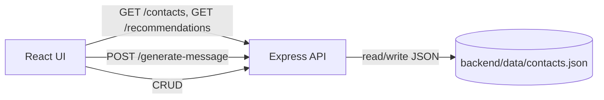

# AI Contact Reminder (Timing-style prototype)

This prototype helps users maintain professional relationships by recommending who to follow up with today and generating a personalized outreach message.

## Architecture

Two small apps:

- `backend/`: Node.js + Express (TypeScript)
  - Loads and persists contacts in `backend/data/contacts.json`
  - Endpoints:
    - `GET /contacts`
    - `POST /contacts`
    - `PUT /contacts/:email`
    - `DELETE /contacts/:email`
    - `GET /recommendations` (who to contact today + `reason`)
    - `POST /generate-message` (simulated AI message generation)
- `frontend/`: React + Vite
  - Fetches `GET /contacts` and `GET /recommendations`
  - Provides:
    - Search + sorting for contacts
    - A recommendations list
    - Contact profile view
    - Add / edit / delete (CRUD)
    - Generate message button for the selected contact

Data flow (simplified):



## Recommendation Logic

`GET /recommendations` recommends a contact if either:

1. `lastContactedDate` is valid and it is `30+` days ago, OR
2. `notes` contains one of the keywords (case-insensitive):
   - `mentor`, `investor`, `advisor`, `friend`

Priority score:

- `priorityScore = overdueDays + keywordBoost`
- `overdueDays` is the number of days since `lastContactedDate` (0 if invalid)
- `keywordBoost` is the weight of the highest-matching keyword:
  - mentor: 40, investor: 30, advisor: 20, friend: 10

Output:

- Sorted by `priorityScore` descending
- Each recommendation returns:
  - `{ "name": string, "reason": string }`

## Message Generation

`POST /generate-message` is implemented without calling an external LLM (no money spent). It uses a deterministic template that includes:

- `relationshipContext`
- `lastConversation`
- contact `company` (from stored contact data)

Request body:

```json
{
  "contactName": "Sarah Chen",
  "relationshipContext": "mentor",
  "lastConversation": "We discussed fundraising strategy"
}
```

Response:

```json
{ "message": "..." }
```

## Error Handling

The backend validates inputs and returns consistent errors as:

```json
{ "error": "human readable message" }
```

Supported behaviors:

- Empty dataset returns `[]` for `GET /contacts` and `GET /recommendations`
- Missing/invalid required fields returns `400`
- Unknown contacts return `404`
- Invalid date inputs are rejected for CRUD endpoints (and recommendations remain robust if existing stored data is malformed)

## How to Run

### 1) Start backend

```bash
cd backend
npm run dev
```

Backend runs on `http://localhost:3001`.

### 2) Start frontend

```bash
cd frontend
npm run dev
```

Frontend runs on `http://localhost:5173` and calls the backend via `http://localhost:3001`.

Optional: set `VITE_API_BASE_URL` in the frontend environment to point to a different backend.

## Key Files

- Backend:
  - `backend/src/index.ts` (server bootstrap)
  - `backend/src/store/contactsStore.ts` (JSON-backed persistence)
  - `backend/src/recommendations.ts` (ranking + reason generation)
  - `backend/src/messageGenerator.ts` (templated message generation)
- Frontend:
  - `frontend/src/App.tsx` (UI + CRUD + message generation wiring)
  - `frontend/src/api.ts` (API client)

## What I Could Improve

- Move the app to the cloud, including the backend deployment and a hosted database (instead of persisting to `backend/data/contacts.json` locally).
- Implement CI/CD so every change automatically runs linting + tests, builds the frontend/backend, and deploys to staging/production.
- Add automated tests to ensure the core functionality stays correct:
  - backend unit tests for recommendation logic + message generation
  - API/integration tests for CRUD + recommendations endpoints
  - frontend tests (and optionally end-to-end tests) covering the main user flows
